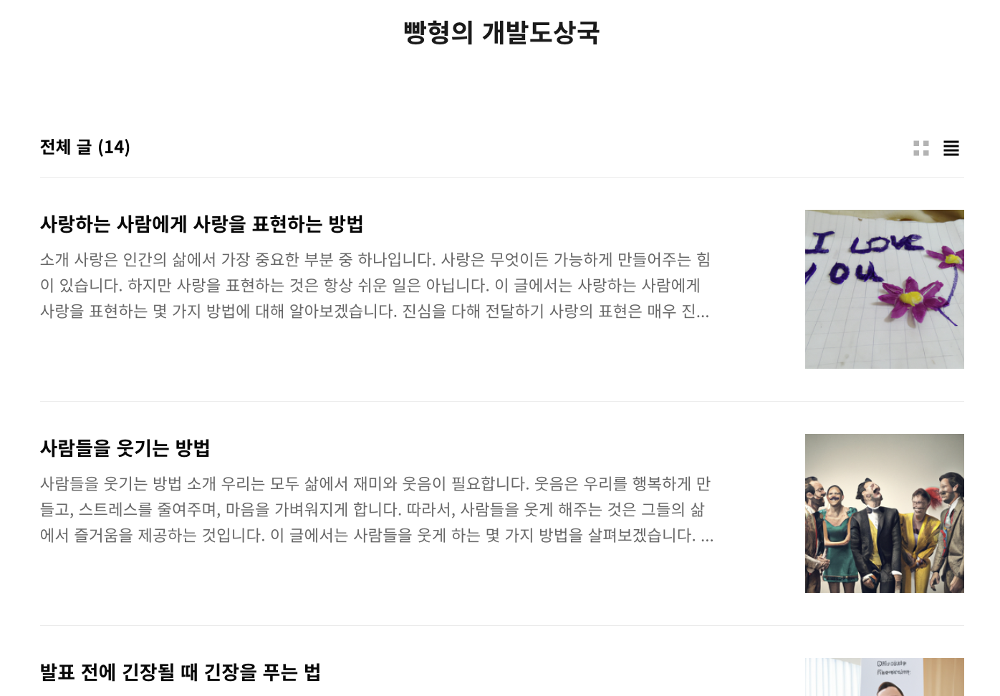

# AI Blog Posting Bot

Blog posting bot using Notion AI, DALL-E to write text, generate images and upload blog post automatically.

Sample blog: https://bbanghyong.tistory.com

| Blog | Post |
|---|---|
|  |  |

## Dependency

- [NotionAI](https://github.com/Vaayne/NotionAI)
- [tistory](https://github.com/WooilJeong/tistory)
- [OpenAI](https://github.com/openai/openai-python)
- [Markdown](https://github.com/Python-Markdown/markdown)
- [Translate](https://github.com/terryyin/translate-python)
- Requests

## Reference

- https://github.com/Vaayne/NotionAI
- https://github.com/WooilJeong/tistory
- https://wooiljeong.github.io/python/tistory/
- https://www.tistory.com/guide/api/manage/register
